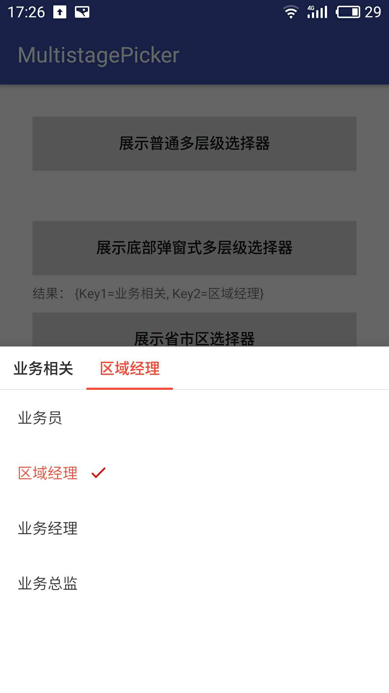
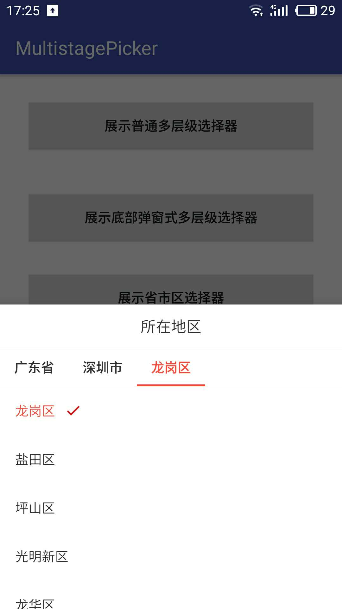

# MultistagePicker

多层级选择器。默认提供了一个由其实现的中国大陆省市区选择器 `RegionPicker`。

[](https://jitpack.io/#stingzhan/MultistagePicker)

## 开始使用

在项目根目录中的 `build.gralde` 文件中：

```groovy
allprojects {
    repositories {
        ...
        maven { url 'https://jitpack.io' }
    }
}
```

在Module中的 `build.graldle` 文件中添加依赖：

```groovy
dependencies {
    implementation 'com.github.stingzhan:MultistagePicker:1.0.0'
}
```

## 用例

#### Step1: 创建一个 `MultistagePickerDataProvider` 为选择器提供数据，示例：

```kotlin
    val options = mapOf(
        "业务相关" to listOf("业务员", "区域经理", "业务经理", "业务总监"),
        "销售相关" to listOf("销售员", "柜长", "销售经理", "展厅经理", "销售总监")
    )

    val dataProvider = object : MultistagePickerDataProvider() {
        private val keys = listOf("Key1", "Key2")

        override fun stageKeys(): List<String> {
            return keys
        }

        override fun stageData(stageKey: String, upperStageSelectedOptions: Map<String, String>): List<String>? {
            return when (stageKey) {
                "Key1" -> options.keys.toList()
                "Key2" -> {
                    val key = upperStageSelectedOptions["Key1"]
                    options[key]
                }
                else -> null
            }
        }
    }
```

#### Step2: 创建一个选择器，示例：

```kotlin
    val simplePicker = MultistagePickerDialog(this, dataProvider)
    simplePicker.setOnPickCompletedListener { selectedOptions ->
        // selectedOptions 存放着选取结果
    }
```

#### Step3: 弹出选择器, 示例：

```kotlin
    simplePicker.show()
```

## 省市区选择器使用：

```kotlin
    val regionPicker = RegionPicker(this)
    regionPicker.setOnAddressPickSuccessListener { region ->
        Log.i("ResultTag", "结果： ${region.province} - ${region.city} - ${region.district}")
    }
    regionPicker.show()
```

设置预选中的省市区值：

```kotlin
    regionPicker.setDefaultRegion(Region("广东省", "深圳市", "龙岗区"))
```

## Sample screenshots




License

-------
    Copyright 2018 stingzhan. https://github.com/stingzhan

    Licensed under the Apache License, Version 2.0 (the "License");
    you may not use this file except in compliance with the License.
    You may obtain a copy of the License at
 
        http://www.apache.org/licenses/LICENSE-2.0

    Unless required by applicable law or agreed to in writing, software
    distributed under the License is distributed on an "AS IS" BASIS,
    WITHOUT WARRANTIES OR CONDITIONS OF ANY KIND, either express or implied.
    See the License for the specific language governing permissions and
    limitations under the License.